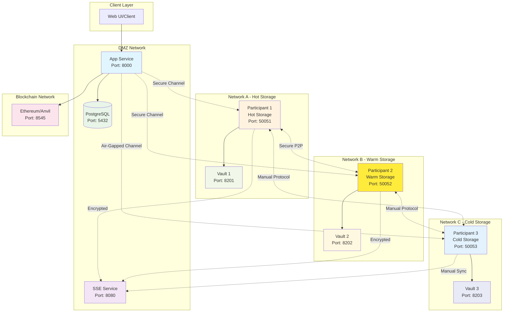

# WaaS - Wallet as a Service

A distributed multi-party computation (MPC) wallet service built with Rust, providing secure cryptocurrency wallet management through threshold signatures. The system uses a 3-participant setup with network isolation where wallets are created and transactions are signed collaboratively. One participant operates as cold storage for enhanced security, with no single point of failure.

## Overview

WaaS implements a threshold signature scheme using the CGGMP21 protocol, where cryptographic keys are distributed across multiple participants. This ensures that no single entity has complete control over user funds, providing enhanced security for cryptocurrency operations.

## Architecture



## API Endpoints

### Authentication
- `POST /api/auth/login` - User authentication
- `POST /api/auth/signup` - User registration

### Users (Protected)
- `GET /api/users/{id}` - Get user information
- `DELETE /api/users/{id}` - Delete user account

### Wallets (Protected)
- `POST /api/wallet` - Create new wallet
- `DELETE /api/wallet/{id}` - Delete wallet
- `POST /api/wallet/{id}/tx` - Send transaction

### SSE Service
- `GET /rooms/{room_id}/subscribe` - Subscribe to room events
- `POST /rooms/{room_id}/issue_unique_idx` - Get unique participant index
- `POST /rooms/{room_id}/broadcast` - Broadcast message to room

## Getting Started

### Quick Start with Docker

**Start all services**
```bash
docker-compose up -d
```

### Testing

1. **Run unit tests**
   ```bash
   cargo test
   ```

2. **Test API endpoints**
   ```bash
   # Health check
   curl http://localhost:8000/health

   # Register user
   curl -X POST http://localhost:8000/api/auth/signup \
     -H "Content-Type: application/json" \
     -d '{"username":"testuser","password":"securepass123","email":"test@example.com"}'

   # Login
   curl -X POST http://localhost:8000/api/auth/login \
     -H "Content-Type: application/json" \
     -d '{"username":"testuser","password":"securepass123"}'
   ```

## Project Structure

```
waas/
├── app/           # Main API service (DMZ network)
├── participant/   # MPC participant nodes (isolated networks)
├── sse/          # Server-Sent Events service (DMZ network)
├── proto/        # Protocol buffer definitions
├── Dockerfile    # Multi-stage Docker build
└── docker-compose.yaml
```

## Security Considerations

- **Key Distribution**: Private keys are never reconstructed in a single location
- **Threshold Signatures**: Requires 2 out of 3 participants for transaction signing
- **Network Isolation**: Each participant operates in separate, isolated networks
- **Cold Storage**: Participant 3 operates as air-gapped cold storage with manual sync protocols
- **Vault Integration**: All key shares are encrypted and stored in HashiCorp Vault
- **JWT Authentication**: API endpoints are protected with JSON Web Tokens
- **Input Validation**: All user inputs are validated and sanitized
- **Secure Channels**: All participant communication uses encrypted channels
- **Manual Protocols**: Cold storage requires manual intervention for enhanced security

## Future Improvements

- [ ] **Multi-chain Support**: Add Bitcoin, Polygon, and other EVM chains
- [ ] **Nonce Management**: Proper transaction nonce tracking and replay protection
- [ ] **Error Recovery**: Robust error handling and transaction retry mechanisms
- [ ] **API Documentation**: OpenAPI/Swagger specification generation
